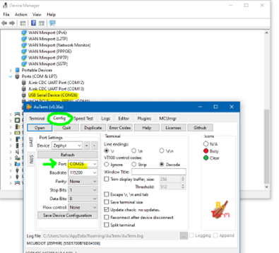
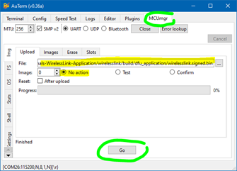

# Externals-WirelessLink-Application Read Me
This repository is home to the firmware application source code of the WL - Wireless Link in the COSMIIC System. Full documentation is available at **[docs.cosmiic.org/Externals/Wireless-Link](https://docs.cosmiic.org/Externals/Wireless-Link)**

## Licensing
Firmware and software files are licensed to open source users by COSMIIC under the MIT License. Refer to the **[license text](https://mit-license.org/)** to understand your permissions.

All files of this category are hosted across COSMIIC GitHub repositories. This includes, but is not limited to...

- Firmware
    - Module source code (bootloaders and applications)
    - External wireless components source code (bootloaders and applications)
- Software
    - API in Matlab
    - Assorted Matlab apps
    - Tools and processes, such as custom linters and GitHub Action workflow files

---

## Component Overview
 The Wireless Link serves as the radio interface to the implant with multiple external interfacing options. The Wireless Link is also used in the SmartCharger. The code can be built with or without charger functionality. The Wireless Link is based on the nRF4340+nRF7002 companion module (Fanstel WT40 BLE+WiFi module) and the CC1101 (Anaren A1101 433MHz module). The Nordic nRF5340 is a capable microcontroller with many peripherals

---

## Technical Overview
This code is based on:
* BLE Peripheral with Nordic UART Serivce and USB ASM CDC: peripheral_uart sample (nrf/samples/bluetooth)
* SDCard: fatfs_fstab sample (zephyr\samples\subsys\fs)
* DFU over USB: **https://academy.nordicsemi.com/courses/nrf-connect-sdk-intermediate/lessons/lesson-9-bootloaders-and-dfu-fota/**

---

## Development Environment
For instructions on installing VS Code and nRF Connect SDK see: **https://academy.nordicsemi.com/courses/nrf-connect-sdk-fundamentals/**

* nRF Connect for VS Code Extension Pack
* Toolchanin/SDK v3.1.1
* VS Code  v1.105.1 

### Open Application
Use the `Externals-WirelessLink-Application/wirelesslink` directory as the project folder in VS Code. Open the nRF Connect extension in the sidebar. Under the Welcome dropdown, click "Open an existing application" and select the "wirelesslink" folder in the file explorer.

### Build Configuration
Under the Applications dropdown, set the board to `cosmiic_wireless_link_nrf5340_cpuapp` and enable debug options

If the custom boards option does not appear, add your `boards` folder to BOARD_ROOT, by going to File -> Preferences -> Settings.  Search for "nRF-Connect: Board Roots" and add path to `C:\Users\username\Documents\GitHub\Externals-WirelessLink-Application\wirelesslink\boards` folder.

---

## Flashing and Debugging

### Hardware Requirements
The Wireless Link (standalone) is intended to operate at 1.8V unless the 1V8_EN solder bridge trace is cut.  If operating at 1.8V, use the nRF7002DK (PCA10143) to Flash and Debug because it also uses 1.8V.

The WirelessLink in the SmartCharger operates at 3.3V and must have the 1V8_EN solder bridge trace cut.  Use the nRF5340DK (PCA10095) to Flash and Debug.  (It uses 3.0V)

You will also need a custom cable to connect the Wireless Link JTAG lines (GND, VCC, RESET, SWCLK, SWDIO) to the DK

### Serial Recovery and Device Firmware Update Mode (USB DFU Mode)
New firmware can be uploaded to the Wireless Link without using the JTAG link. To load new firmware onto the Wireless Link / Smart Charger using the DFU Mode:
* Download AuTerm (https://github.com/thedjnK/AuTerm/releases), Version 0.36.
* Enter DFU mode by holding SW2 (button1, on the right) while plugging in the board. The Green LED should turn on and stay solid.
* Open AuTerm and set the Serial Port in the “Config” tab to point to your Wireless Link

* In the “MCUmgr” tab, press "Connect" and set the “File” to point to your built application. This can be either `wirelesslink.signed.bin` (unzipped from `build/dfu_application.zip`) folder or `build/wirelesslink/zephyr/zephyr.signed.bin`

* Set “No Action”, and hit Go

* Power cycle the Smart Charger and note that the version number is the expected version number on the Home Screen

NOTE: 

:::warning NOTE

- Unclear if both the net core and app core can be updated. Seems to only update the app core.
- See **https://academy.nordicsemi.com/courses/nrf-connect-sdk-intermediate/lessons/lesson-9-bootloaders-and-dfu-fota/** for more information on this process

:::

### Debugging
Debug messages can be viewed in JLink RTT Viewer. 

## Pin definitions

***Indicates use in Smart Charger***
All GPIO can be used as I2C, UART, SPI, or PWM 
Primary function is as currently configured in board files.  Overlays can be used to provide alternate functions

| GPIO | Primary Function | Alt Function | Accessibility |
|---|---|---|---|
| P0.00 | XL1 | | in module |
| P0.01 | XL2 | | in module |
| P0.02 | ***Charger DCDC_EN***| GPIO/NFC1 | expansionport |
| P0.03 | ***Charger RESET_DISPLAY***| GPIO/NFC2 | expansionport |
| P0.04 | ***SmartCoil UART3_TX*** | GPIO/AIN0 | expansionport |
| P0.05 | ***SmartCoil UART3_RX*** | GPIO/AIN1 | expansionport |
| P0.06 | CC1101_GDO0 |  | expansionport |
| P0.07 | BUZZER_PWM |  | expansionport, audio |
| P0.08 | ***HS_SPI4 SCK (SD Card)*** | GPIO | expansionport, charger IO connector (optA) |
| P0.09 | ***HS_SPI4 MOSI (SD Card)*** | GPIO | expansionport, charger IO connector (optA) |
| P0.10 | ***HS_SPI4 MISO (SD Card)*** | GPIO | expansionport, charger IO connector (optA) |
| P0.11 | ***HS_SPI4 CS (SD Card)*** | GPIO | expansionport |
| P0.12 | BUCKEN nRF7002 | NC | in module |
| P0.13 | QSPI DATA0 nRF7002 |  | in module |
| P0.14 | QSPI DATA1 nRF7002 |  | in module |
| P0.15 | QSPI DATA2 nRF7002 |  | in module |
| P0.16 | QSPI DATA3 nRF7002 |  | in module |
| P0.17 | QSPI CLK nRF7002 |  | in module |
| P0.18 | QSPI CS nRF7002 | GPIO | expansionport |
| P0.19 | CC1101_GDO2 | GPIO | expansionport |
| P0.20 | CC1101_CS | GPIO | expansionport |
| P0.21 | UART0_RX | GPIO | expansionport, charger IO connector |
| P0.22 | LED_BLUE | GPIO | expansionport, LED |
| P0.23 | IRQ nRF7002 | NC | in module |
| P0.24 | COEX_GRANT nRF7002 | NC | in module |
| P0.25 | CC1101_MISO | shareable SPI1_MISO | expansionport, charger IO connector (optB)  |
| P0.26 | UART0_TX | GPIO/AIN5 | expansionport, charger IO connector |
| P0.27 | AIN6 (VBATT) | GPIO | expansionport, charger IO connector |
| P0.28 | COEX_REQ nRF7002 | NC | in module |
| P0.29 | COEX_STAT1 nRF7002 | NC | in module |
| P0.30 | COEX_STAT0 nRF7002 | NC | in module |
| P0.31 | IOVDD_EN | NC | in module |
| P1.00 | 3V3_EN | | on board |
| P1.01 | SW1 (BUTTON0) | GPIO | expansionport, button on Fanstel side |
| P1.02 | IMU SDA | shareable I2C2 SDA | expansionport, charger IO connector |
| P1.03 | IMU SCL | shareable I2C2 SCL | expansionport, charger IO connector |
| P1.04 | GPIO |  | expansionport |
| P1.05 | ***COILDRIVE_PWM ***| GPIO | expansionport |
| P1.06 | ***COILDRIVE_EN***| GPIO | expansionport |
| P1.07 | LED_GREEN | GPIO | expansionport, LED |
| P1.08 | CC1101_MOSI | shareable SPI1_MOSI | expansionport, charger IO connector (optB) |
| P1.09 | CHRG_PG | | expansionport |
| P1.10 | CHRG_STAT2 |  | expansionport |
| P1.11 | CHRG_STAT1 | | expansionport |
| P1.12 | IMU_INT |  | expansionport |
| P1.13 | SW2 (BUTTON1), MCUBUTTON | GPIO | expansionport, button on Anaren side |
| P1.14 | LED_RED | GPIO | expansionport, LED |
| P1.15 | CC1101_CLK | shareable SPI1_SCK | expansionport, charger IO connector (optB)  |

### Peripherals
* USB/UART
    * USB CDC_ACM Virtual Serial Port functionality is implemented voer the USB D+/D- pins
    * UART0 (TX=P0.26, RX=P0.21) will be used for UART (duplicate of USB functionality for speedgoat/UART/RS-232 interface)
    * UART3 (TX=P.04, RX=P0.05) will be used for SmartCoil UART.  If SmartCoil is not implemented, these can be used as GPIO or AIN
* SPI
    * SPI1 (MOSI=P1.08, MISO=P0.25, SCK=P1.15) is used for CC1101 (Med Radio) but could be shared with other SPI peripherals
    * SPI4 (MOSI=P0.09, MISO=P0.10, SCK=P0.08, CS=P0.11) is highspeed SPI used for SD Card but could be used for other SPI peripherals
* I2C
   * I2C2 (SDA=P1.02, SCL=P1.03) is used for IMU and charger peripherals but could be shared with other I2C peripherals
   * ISM330IS IMU (accel+gyro+ISPU) 0x3c
   * Charger
        * NHD-0420 LCD Display 0x3C
        * DS3231  External RTC 0x68
        * TPS55289 DC/DC COnverter 0x74
        * ADS1110 ADC for Thermistor 0x48
        * INA236A System Power Supply Monitor 0x41
        * INA236A CoilDrive Power Supply Monitor 0x40
* Pulse Width Modulation
    * PWM0 (BUZZER_PWM=P0.07) used to generate audio tones
    * PWM1 (COILDRIVE_PWM=P1.05) can be repurposed if not using in Charger
* Analog Input
    * AIN6 (P0.27) measures VBATT*0.354, used to monitor battery voltage. 
    * If the smart coil is not used, AIN0/AIN1 are available
 

## Button Functions
* Buttons can be programmed to perfrom any API function, short press, long press
* If nothing programmed, default long press function on both buttons is to enter sleep state
* While in sleep state, either button will wake  
* SW1 (SC:orange, WL:nRF side) extra long press (10s) resets device.  If SW2 is held down after SW1 (and is still held), device will enter serial recovery (see above)
* SW2 (SC:blue, WL:Anaren side) extra long press (10s) starts BLE pairing mode.  If SW1 is held down afetr SW2 (and is still held), device will delete existing bonds 
* Note that the shortpress action occurs on button release whereas longpress actions occur once the button has been held for long enough (2s) and do not require releasing the button. Therefore SW1 and SW2 longpress actions will occur prior to the extralongpress actions

## LED Indicators

### LEDs - Wireless Link Mode
* Blue LED blinking - indicates BLE advertising
* Ble LED solid - BLE connected
* Green LED solid - Serial recovery mode
* Green blink - MedRadio Response received
* Red blink - MedRadio Response timeout or bad packet

### LEDs - Charger Mode
* Red LED - Error
* Green LED blinking - Charging Implant
* Green LED solid - Implant fully charged
* Yellow LED - Warning

---

## User Storage (NVS)
* Button actions, MedRadio settings, and Charger settings are stored in user_storage partition

---

## Storage (NVS)
* BLE bonding data is stored in storage partition

---

## BLE Pairing/Bonding
* If security is enabled, the WirelessLink requires a passkey to pair/bond.  The passkey can be optained through the API (requires USB or UART connection).  If bonds are deleted on the Wireless Link, make sure to delete any bonding information on the host device as well.

---

## API
### Packet format
The packet format is the same whether or not the packet is sent via BLE, USB, or UART

|header| |                                             |payload|
|--- |---      |---                        |                ---|
|**SYNC**| **CMD** |   **LEN**                  |            ...    |
|0xFF    | seebelow|  lengthOfPacket (up to 255)|    up to 252 bytes|
multiple bytes are presented Little Endian

### Commands

| NAME | CMD    |  bytesToWL | bytesFromWL  |Description|
|---|---|---|---|---|  
|GET_PRODUCT_ID              |0x20|     0   |     4       |   Returns HW and SW revision numbers |
|                            |    |         |             |                                      |
|**WIRELESS LINK**           |    |         |             |                                      |
|WL_ENTER_DFU_MODE           |0x21|         |             | Not Yet Implemented. Hold button1 during reset to enter serial recovery|
|WL_ERASE_BONDS              |0x22|     0   |     1       | Returns erasebonds result |
|WL_RESET                    |0x23|     0   |     0       |     Reset WL |
|WL_START_PAIRING            |0x1F|     0   |    1        | Returns start_pairing_mode result |
|WL_GET_PASSKEY              |0x1E|     0   |      4      | Returns 4-digit passcode to enter into host for pairing|
|These commands allow accelerating long flash read/write commands with PM. WL Image is currently only 512 bytes| | | | |
|WL_WRITE_IMAGE              |0x24|    4+N  |    0        |  Send 4 Address Bytes followed by N (up to 248 over USB, 237 over BLE) bytes to write to WL image                 |
|WL_READ_IMAGE               |0x25|    5    |    N        |  Send 4 Address Bytes and N (up to 252 over USB, 241 over BLE).  Returns N bytes of WL inage starting from addr   |
|WL_PMBOOT_WRITE             |0x26|    7    |    0        |  Send 4 addr bytes + 2 pgsize bytes + 1 sector byte.  Copies WL image to PM flash          |
|WL_PMBOOT_READ              |0x27|    6    |    0        |  Send 4 addr bytes + 2 size bytes.  Copies PM flash to WL image                            |
|WL_PMFILE_READ              |0x28|    7    |    0        |  Send 4 addr bytes + 2 size bytes + 1 file byte.  Copies PM file data to WL image          |
|WL_PMSCRIPT_WRITE           |0x29|         |             | Not yet implemented |                                                                      |
|                            |    |         |              | |
|                            |    |         |             | |
|WL_SET_BUTTON_ACTION        |0x30|    1+N  |    0        |  Send 1 action index + N packet bytes to execute. Action index (0=button1 short, 1=button2 short, 2=button1 long, 3=button2 long)    |
|WL_GET_BUTTON_ACTION        |0x31|    1    |    N        |  Read back for above                                                                                                                 |
|WL_SET_BUTTON_ACTION_TEMP   |0x32|         |             | Not yet implemented, temporary version of above (not saved in flash)                                                                 |
|WL_SET_IMU_MODE             |0x33|    1    |    0        |  Currently enables or disables accel task.  Sets one of the predetermined IMU modes (accel, gyro, accel+gyro, accel+gyro+ispu)       |
|WL_GET_IMU_MODE             |0x34|         |             | Not yet implemented.  Read back for above                                                                                            |
|WL_SET_IMU_MODE_TEMP        |0x35|         |             | Not yet implemented. temporary version of above (not saved in flash)                                                                 |
|WL_GET_IMU_DATA             |0x36|         |             | Not yet implemented.  Reads available IMU data                                                                                       |
|WL_SET_IMU_ACTION           |0x37|         |             | Not yet implemented. Sets the IMU condition and payload that will be sent to implant if condition is met                             |
|WL_GET_IMU_ACTION           |0x38|         |             | Not yet implemented. Read back for above                                                                                             |
|WL_SET_IMU_ACTION_TEMP      |0x39|         |             | Not yet implemented. temporary version of above (not saved in flash)                                                                 |
|WL_GET_IMU_REGISTER         |0x3A|         |             | Not yet implemented. Read an IMU register directly (Low Level)                                                                       |
|WL_SET_IMU_REGISTER         |0x3B|         |             | Not yet implemented. Write an IMU register directly (Low Level)                                                                      |
|WL_SET_LED_MODE             |0x3C|    1    |    0        |  Set one of the predetermined LED modes: BLUE_LED_BLE_ADV=BIT0, GREEN_LED_RADIO_RESPONSE=BIT1, RED_LED_RADIO_ERROR=BIT2, LED_CHARGER=BIT3, LED_MANUAL=BIT6, LED_AUDIO_OFF=BIT7   |
|WL_GET_LED_MODE             |0x3D|    0    |    1        |   Read back for above                                                                                                                                                            |
|WL_SET_LED_MODE_TEMP        |0x3C|         |             | Not yet implemented.                                                                                                                                                           |
|WL_SET_LEDS                 |0x3F|    3    |    0        |  Force the LEDs to a specific state.  LED Mode must be LED_MANUAL.  Red, Green, Blue                                                                                             |
|WL_GET_LEDS                 |0x40|         |             | Not yet implemented.  Read the current LED state                                                                                                                                 |
|WL_GET_CHARGE_STATUS        |0x41|    0    |    1        |  Read MCP73833 charging status.  BIT0=PowerGood (on USB), BIT1=STAT1 (charging), BIT2=STAT2 (done charging)                                                                      |
|WL_SET_BUZZER_PERIOD        |0x42|   N*4+1 |    1        |  Send 1 NumberOfTones(N) byte  + N*(2bytes note period + 2bytes note length) (in us).  Returns N                                                                                 |
|WL_ENTER_LOW_POWER          |0x43|    0    |    0        |  Enter Low Power mode                                                                                                                                                            |
|WL_BLE_START_ADV            |0x44|    0    |    0        |  Start BLE advertising again.  Device will advertise for first 30s after startup automatically                                                                                   |
|WL_BLE_STOP_ADV             |0x45|    0    |    0        |  Stop advertising                                                                                                                                                                |
|WL_BLE_GET_ADC              |0x46|    0    |    2        |  Returns 2 bytes (battery voltage in mV)                                                                                                                                         |
|                            |    |         |             | |
|**ACCESS POINT**            |    |         |             | |
|AP_SEND_RECV_MSG            |0x47|   N     |   M+2       | Send the implant a message and await response (or timeout).  Include everything to send over radio except address.  Returns radio response except address (appends RSSI/CRC/LQI).    
|AP_SET_RADIO_SETTINGS	     |0x48|   7     |   7         | Write the MedRadio settings: AP/PM addresses and fixed channel, WOR settings and timeouts (saved to flash)
|AP_GET_RADIO_SETTINGS  	 |0x49|   0     |   7         | localAddr, RemoteAddr, Chan, TXpower, WORInt, RXtimeout, Retries
|AP_SET_RADIO_SETTINGS_TEMP  |0x4A|   7     |   7         | Write the MedRadio settings: AP/PM addresses and fixed channel, WOR settings and timeouts (temporary)
|AP_CLEAR_CHANNEL_SEARCH     |0x4B|   1     |   2         | Send dwell time (1 byte) in 10ms increments (1=10ms, 250=25s) Returns clearest channel + RSSI (int8_t)
|AP_SET_SESSION_TIME         |0x4C|   1     |   0         | Set time since session lasts (0 to disable Clear Channel Search), 5 for MedRadio protocol
|AP_GET_SESSION_TIME_LEFT    |0x4D|   0     |   2         | Get time since last MedRadio RX 
|AP_SET_SESSION_MAINTAIN     |0x4E|   1     |   0         | 1=maintain (if sessiontime>0) 0, don't maintaitn Not yet implemented.    Read back for above
|AP_ENCRYPTION               |0x4F|  1      |   0         | Enable/disable encryption
|AP_RESTORE_RADIO            |0x50|  1      |    0        |  0=Bootloader, 1=App (from flash)
|                            |    |         |             |     |
|**CHARGER**                 |    |         |             |     |
|CD_SET_PERIOD               |0x52|    4    |    0        |  Set coil period in ns (nominally 3.5kHz for NNP)     
|CD_GET_PERIOD               |0x53|    0    |    4        |  Set coil period in ns (nominally 3.5kHz for NNP)  
|CD_START_DRIVE              |0x54|    0    |    0        |  Turn on Coil (if DCDC on)    
|CD_STOP_DRIVE               |0x55|    0    |    0        |  Turn off Coil (if DCDC on)  
|CD_GET_COIL_POWER           |0x56|    0    |    4        |  Read coil drive power 2 current bytes (int16, mA) + 2 voltage bytes (uint16, mV) 
|CD_GET_CHARGER_POWER        |0x57|    0    |    4        |  Read system power     2 current bytes (int16, mA) + 2 voltage bytes (uint16, mV)  Read DC voltage input of coil drive   
|CD_GET_THERMISTOR           |0x58|    0    |    2        |  Read Thermistor (not for MCU coil)  2 bytes (in 0.1degC)               |
|CD_GET_COIL_CONNECT         |0x59|         |             | Not yet implemented.  Read coil connection status (not for MCU coil)    |
|CD_GET_SERIAL               |0x5E|         |             | Not yet implemented.                          |
|CD_SEND_SERIAL              |0x5F|         |             | Not yet implemented.                          |
|CD_START_DCDC               |0x62|    0    |    0        |  Start DCDC converter (supplies Coil Drive)   |
|CD_STOP_DCDC                |0x63|    0    |    0        |  Stop DCDC converter (supplies Coil Drive)    |     
|CD_SET_DCDC_VOLT            |0x64|    2    |    0        |  Set DCDC voltage: 2 bytes (uint16, mV)       |
|                            |    |         |             | |
|DISPLAY_SET                 |0x6D|    1+4+N|    0        |  clear screen, len1, [str1 ...], len2, [str2 ...], len3, [str3 ...], len4, [str4 ...]|
|                            |    |         |             | |
|CD_GET_RTC                  |0x70|    0    |    7        |  sec, min, hour, weekday, day, month, year|
|CD_SET_RTC                  |0x71|    7    |    0        |  sec, min, hour, weekday, day, month, year|
|                            |    |         |             | |
|CD_GET_PARAMS               |0x72|         |             | |
|CD_SET_PARAMS               |0x73|         |             | |
|                            |    |         |             | |
|**SMART COIL (coil UART)**  |    |         |             | |
|commands forward cmd and payload on the smartcoil and back
|COIL_GET_THERMISTOR_1       |0x78|         |             | |
|COIL_GET_THERMISTOR_2       |0x79|         |             | |
|COIL_GET_PRODUCT_ID         |0x80|         |             | |
|COIL_ACCEL_OFF              |0x7A|         |             | |
|COIL_ACCEL_ON               |0x7B|         |             | |
|COIL_GET_ACCEL              |0x7C|         |             | |
|COIL_GET_PRODUCT_ID         |0x80|         |             | |
|COIL_SET_LED                |0x81|         |             | |
|                            |    |         |             | |
|These SD card commands are for testing and may be removed | | | | |
|SD_WRITE                    |0x90|   1+N   |   1         | 1 lenToWrite (N) byte + N data bytes (up to 251). Returns 1 if successful, 0 otherwise  |
|SD_READ                     |0x91|    5    |   N         | 4 addr bytes + 1 lenToRead (N) byte.  Returns N bytes (up to 252)                       |
|SD_INIT                     |0x92|    0    |   0         | Init SD Card                                                                            |
|SD_DIR                      |0x93|    0    |   0         | Dir info visible in debug terminal only                                                 |
|SD_GET_LOG_LENGTH           |0x94|    0    |   4         | 4 length byte (uint32)                                                                  |
|SD_FLUSH_LOG                |0x95|    0    |   1         | Returns 1 if successful, 0 otherwsie                                                    |
|                            |    |         |             | |
|CHG_GET_CHARGEMODE          |0xA0|    0    |   1         | |
|CHG_SET_CHARGEMODE          |0xA1|    1    |   0         | |

## Future updates:
* Some of the GPIO is defined in wlgpio.c/h and the generic GPIO API is used.  These GPIO definitions may be moved to the devicetree
* The sensor thread and ISM330IS is not currently enabled.  The sensor API could be used with a driver implemented for ISM330IS.  However, the sensor API does not directly supprt some of the advanced functions (ISPU, quaternion output).  We will likely implement I2C generic code without a driver
* The CC1101 is implemented without a driver
* The Charger I2C devices are implemented without drivers
* Charger vs Wireless link is #define in main.c.  May move to CONFIG in prj.comf or build directive